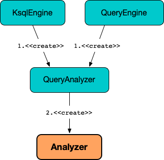

# Analyzer

## Creating Instance

`Analyzer` takes the following to be created:

* <span id="metaStore"> [MetaStore](MetaStore.md)
* <span id="topicPrefix"> Topic Prefix
* <span id="rowpartitionRowoffsetEnabled"> `rowpartitionRowoffsetEnabled` flag
* <span id="pullLimitClauseEnabled"> [ksql.query.pull.limit.clause.enabled](KsqlConfig.md#KSQL_QUERY_PULL_LIMIT_CLAUSE_ENABLED) configuration property

`Analyzer` is created when:

* `QueryAnalyzer` is [created](QueryAnalyzer.md#analyzer)



## <span id="analyze"> Query Analysis

```java
Analysis analyze(
  Query query,
  Optional<Sink> sink)
```

`analyze` creates a [Visitor](#Visitor) (for the given [Query](parser/Query.md) and a flag to indicate whether the sink is defined or not for persistent queries).

`analyze` requests the `Visitor` to [process](parser/AstVisitor.md#process) the given `Query` and [analyzeNonStdOutSink](#analyzeNonStdOutSink) if the sink is defined.

`analyze` requests the `Visitor` to [validate the analysis](#validate).

In the end, `analyze` requests the the `Visitor` for the [Analysis](#analysis).

`analyze` is used when:

* `QueryAnalyzer` is requested to [analyze a query](QueryAnalyzer.md#analyze)

## <span id="Visitor"> Visitor

`Visitor` is a [DefaultTraversalVisitor](parser/DefaultTraversalVisitor.md) to produce an `AstNode` that `Analyzer` uses to [analyze queries](#analyze).

`Visitor` is a `private final` class of `Analyzer`.

### <span id="analysis"> Analysis

`Visitor` creates an [Analysis](Analysis.md) when created.

The `Analysis` instance is mutated (_changed_) while visiting AST nodes while [analyzing a query](#analyze).

### <span id="visitAliasedRelation"> visitAliasedRelation

```java
AstNode visitAliasedRelation(
  AliasedRelation node,
  Void context)
```

`visitAliasedRelation` makes sure that the `Table` relation is registered in the [MetaStore](#metaStore) and requests the [Analysis](#analysis) to [register the alias with the DataSource](Analysis.md#addDataSource).

`visitAliasedRelation` is part of the [AstVisitor](parser/AstVisitor.md#visitAliasedRelation) abstraction.

### <span id="visitSelect"> visitSelect

```java
AstNode visitSelect(
  Select node,
  Void context)
```

`visitSelect`...FIXME

`visitSelect` is part of the [AstVisitor](parser/AstVisitor.md#visitSelect) abstraction.
