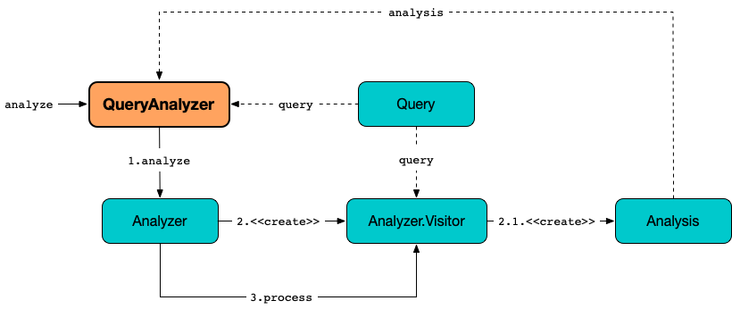

# QueryAnalyzer

## Creating Instance

`QueryAnalyzer` takes the following to be created:

* <span id="metaStore"> [MetaStore](../MetaStore.md)
* <span id="outputTopicPrefix"> [ksql.output.topic.name.prefix](../KsqlConfig.md#KSQL_OUTPUT_TOPIC_NAME_PREFIX_CONFIG)
* <span id="rowpartitionRowoffsetEnabled"> [ksql.rowpartition.rowoffset.enabled](../KsqlConfig.md#KSQL_ROWPARTITION_ROWOFFSET_ENABLED)
* <span id="pullLimitClauseEnabled"> [ksql.query.pull.limit.clause.enabled](../KsqlConfig.md#KSQL_QUERY_PULL_LIMIT_CLAUSE_ENABLED)

`QueryAnalyzer` is created when:

* `KsqlEngine` is requested to [analyzeQueryWithNoOutputTopic](../KsqlEngine.md#analyzeQueryWithNoOutputTopic)
* `QueryEngine` utility is used to [buildQueryLogicalPlan](../QueryEngine.md#buildQueryLogicalPlan)

## <span id="analyzer"> Analyzer

Unless given, `QueryAnalyzer` creates an [Analyzer](../analyzer/Analyzer.md) when [created](#creating-instance).

The `Analyzer` is used to [analyze a query](#analyze).

## <span id="analyze"> Query Analysis

```java
Analysis analyze(
  Query query,
  Optional<Sink> sink)
```



`analyze` requests the [Analyzer](#analyzer) to [analyze the query](../analyzer/Analyzer.md#analyze).

`analyze` requests the [pull](#pullQueryValidator) or [push query validator](#pushQueryValidator) to [validate the analysis](QueryValidator.md#validate) based on whether it is a [pull query](../parser/Query.md#isPullQuery) or not, respectively.

---

The optional `Sink` can only be defined when `QueryEngine` is requested to [buildQueryLogicalPlan](../QueryEngine.md#buildQueryLogicalPlan).

---

`analyze` is used when:

* `KsqlEngine` is requested to [analyzeQueryWithNoOutputTopic](../KsqlEngine.md#analyzeQueryWithNoOutputTopic)
* `QueryEngine` is requested to [buildQueryLogicalPlan](../QueryEngine.md#buildQueryLogicalPlan)
