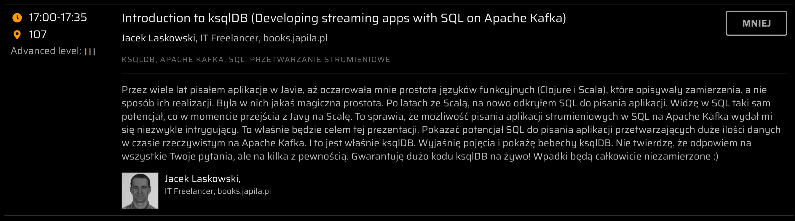

# YavaConf 2022

This is the demo part of my talk about ksqlDB at [Ya!vaConf](https://yavaconf.com/) conference in Warsaw Poland, 28 September 2022.

<figure markdown>
  
</figure>

## Start Confluent Platform (No ksqlDB Yet)

```console
./start-confluent.sh docker-compose.yml
```

## CLI

```sql
SHOW TOPICS;
```

```sql
CREATE STREAM names (name STRING)
WITH (kafka_topic='names', partitions=1, value_format='kafka');
```

```sql
SELECT * FROM names;
```

```sql
SELECT * FROM names EMIT CHANGES;
```

```console
echo yavaconf | kcat -P -b :9092 -t names
echo java | kcat -P -b :9092 -t names
```

```sql
SHOW FUNCTIONS;
```

```sql
DESCRIBE FUNCTION ucase;
```

```sql
SELECT UCASE(name) upper FROM names;
```

```sql
CREATE STREAM uppers AS
  SELECT UCASE(name) upper
  FROM names;
```

```sql
SHOW QUERIES;
```

```sql
EXPLAIN CSAS_UPPERS_7;
```

## REST API

ksqlDB uses [Eclipse Vert.x](https://vertx.io/) to handle HTTP communication using [REST endpoints](../api/ServerVerticle.md#setupRouter).

```console
http -b localhost:8088/info
```

```console
http -b localhost:8088/healthcheck
```

```console
http -b localhost:8088/status
```

```console
http -b http://localhost:8088/ksql ksql="LIST STREAMS;"
```

## Queries File and Headless Execution Mode

You can execute all the above KSQL statements (incl. queries) using a queries file. The idea is to git-control it.

```console
./bin/ksql -f yavaconf.ksql
```

You can also execute ksqlDB server in [headless execution mode](../headless/index.md).

## (Re)Start Confluent Platform

This time we're going to use the entire Confluent Platform (incl. ksqlDB).

```console
./start-confluent.sh docker-compose.yml
```

## Dockerized ksqlDB CLI for Queries File

```console
docker run \
  --network=confluent-platform_default \
  -it \
  -v $(pwd):/home/appuser \
  confluentinc/cp-ksqldb-cli http://ksqldb-server:8088 \
  -f yavaconf.ksql
```
