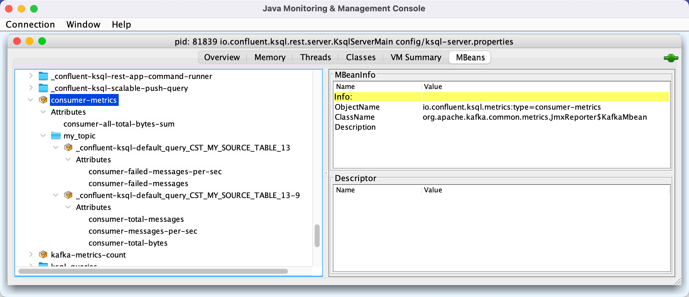

# StreamsErrorCollector

`StreamsErrorCollector` is a [MetricCollector](MetricCollector.md) to [record consumer failed messages metrics](#sensors) (per [source topic](#buildSensors)).

The metrics are registered in `consumer-metrics` group.

<figure markdown>
  
</figure>

## Creating Instance

`StreamsErrorCollector` takes the following to be created:

* <span id="collectors"> [MetricCollectors](MetricCollectors.md)

`StreamsErrorCollector` is created using [create](#create).

### <span id="create"> Creating StreamsErrorCollector

```java
StreamsErrorCollector create(
  String applicationId,
  MetricCollectors collectors)
```

`create` creates a [StreamsErrorCollector](#creating-instance) with the given [MetricCollectors](MetricCollectors.md).

`create` requests the `MetricCollectors` to [register the StreamsErrorCollector](MetricCollectors.md#addCollector) for the `applicationId`.

---

`create` is used when:

* `QueryBuilder` is requested to [buildStreamsProperties](../QueryBuilder.md#buildStreamsProperties) (and makes the `StreamsErrorCollector` available as [ksql.internal.streams.error.collector](../KsqlConfig.md#KSQL_INTERNAL_STREAMS_ERROR_COLLECTOR_CONFIG))

## <span id="sensors"><span id="topicSensors"> Topic Sensors

```java
Map<String, TopicSensors<Object>> topicSensors
```

`StreamsErrorCollector` [builds sensors per topic](#buildSensors) when [recordError](#recordError).

### <span id="consumer-failed-messages"><span id="CONSUMER_FAILED_MESSAGES"> consumer-failed-messages

### <span id="consumer-failed-messages-per-sec"><span id="CONSUMER_FAILED_MESSAGES_PER_SEC"> consumer-failed-messages-per-sec

## <span id="recordError"> Recording Error

```java
void recordError(
  String topic)
```

`recordError` looks up the given `topic` in the [topic sensors](#topicSensors) (or [creates a new one](#buildSensors)) and increments the sensor.

---

`recordError` is used when:

* `LogMetricAndContinueExceptionHandler` is requested to [handle a deserialization exception](LogMetricAndContinueExceptionHandler.md#handle)

### <span id="buildSensors"> buildSensors

```java
TopicSensors<Object> buildSensors(
  String topic)
```

`buildSensors` [builds](#buildSensor) the [sensors](#sensors) for the `topic`.
