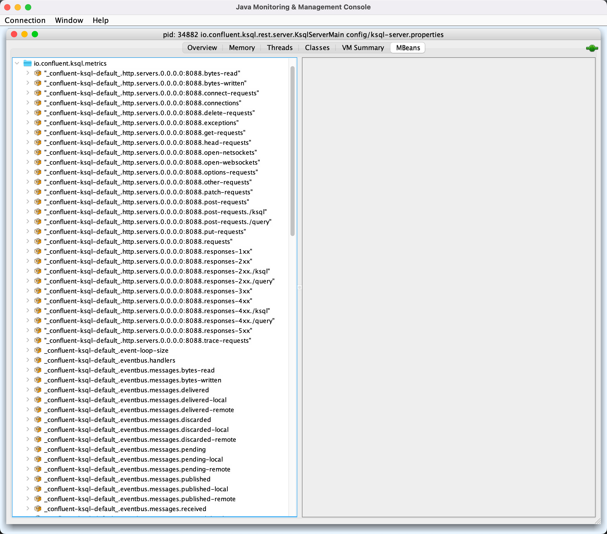

# Performance Metrics

ksqlDB uses [MetricCollectors](MetricCollectors.md) to manage [MetricCollector](MetricCollector.md)s and collect performance metrics.

Runtime metrics are reported regularly for a [KsqlEngine](../KsqlEngine.md#aggregateMetricsCollector) and [available using JMX](MetricCollectors.md#metrics) (in `io.confluent.ksql.metrics` JMX namespace).

<figure markdown>
  
</figure>

`LIST [STREAMS|TABLES] EXTENDED` and `DESCRIBE [sourceName] EXTENDED` commands can be used to show the metrics.

Metric Name | Description
------------|------------
 [num-active-queries](../KsqlEngineMetrics.md#configureNumActiveQueries) | The current number of active queries running in this engine
 [num-persistent-queries](../KsqlEngineMetrics.md#configureNumPersistentQueries) | Number of persistent queries running in this engine

##  KsqlMetricsExtension

[KsqlMetricsExtension](KsqlMetricsExtension.md) is for developers to provide custom metrics that will be emitted along with the default KSQL engine JMX metrics.
