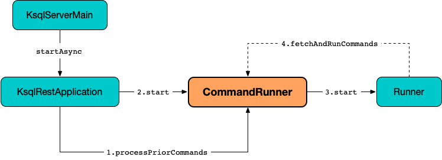

# CommandRunner

`CommandRunner` is responsible for [command execution](#start) for [KsqlRestApplication](KsqlRestApplication.md#commandRunner) (on a separate Java thread using [CommandQueue](#commandStore)).

<figure markdown>
  
</figure>

## Creating Instance

`CommandRunner` takes the following to be created:

* <span id="statementExecutor"> [InteractiveStatementExecutor](InteractiveStatementExecutor.md)
* [CommandQueue](#commandStore)
* <span id="maxRetries"> `maxRetries`
* <span id="clusterTerminator"> `ClusterTerminator`
* <span id="serverState"> `ServerState`
* <span id="ksqlServiceId"> ksql Service ID
* <span id="commandRunnerHealthTimeout"> commandRunnerHealth Timeout
* <span id="metricsGroupPrefix"> metricsGroup Prefix
* [Command Deserializer](#commandDeserializer)
* <span id="errorHandler"> Error Handler
* <span id="kafkaTopicClient"> `KafkaTopicClient`
* <span id="commandTopicName"> Name of the Command Topic
* <span id="metrics"> `Metrics`

`CommandRunner` is created when:

* `KsqlRestApplication` utility is used to [build a KsqlRestApplication](KsqlRestApplication.md#buildApplication-commandRunner) (to create [KsqlResource](KsqlResource.md#commandRunner) and [KsqlRestApplication](KsqlRestApplication.md#commandRunner) itself)

## <span id="commandStore"> CommandQueue

`CommandRunner` is given a [CommandQueue](CommandQueue.md) when [created](#creating-instance).

The `CommandQueue` is used when `CommandRunner` is requested for the following:

* [processPriorCommands](#processPriorCommands)
* [fetchAndRunCommands](#fetchAndRunCommands)

### <span id="getCommandQueue"> getCommandQueue

```java
CommandQueue getCommandQueue()
```

`getCommandQueue` is used when:

* `KsqlResource` is requested to [configure](KsqlResource.md#configure) and [handleKsqlStatements](KsqlResource.md#handleKsqlStatements)

## <span id="commandDeserializer"> Command Deserializer

`CommandRunner` is given a `Deserializer` (Apache Kafka) of [Command](Command.md)s when [created](#creating-instance).

The `Deserializer` is used in the following:

* [processPriorCommands](#processPriorCommands)
* [start](#start) (to [fetchAndRunCommands](#fetchAndRunCommands) and [executeStatement](#executeStatement))

## <span id="start"> Start Processing Queued Commands

```java
void start()
```

`start` creates and starts a Java thread (on a single-threaded thread pool) to continuously [fetch and run queued commands](#fetchAndRunCommands).

Every time [fetchAndRunCommands](#fetchAndRunCommands) is executed, the thread prints out the following TRACE message to the logs:

```text
Polling for new writes to command topic
```

---

`start` is used when:

* `KsqlRestApplication` is requested to [initialize](KsqlRestApplication.md#initialize)

### <span id="fetchAndRunCommands"> Fetching and Running Queued Commands

```java
void fetchAndRunCommands()
```

`fetchAndRunCommands` requests the [CommandQueue](#commandStore) for [new commands](CommandQueue.md#getNewCommands) (with `5 second` timeout).

If there are no commands, `fetchAndRunCommands` leaves early (also checks if the [commandTopicExists](#commandTopicExists)).

`fetchAndRunCommands` [checks for incompatible commands](#checkForIncompatibleCommands) and then tries to [find TERMINATE CLUSTER command](#findTerminateCommand) (to [terminate the cluster](#terminateCluster) if found).

`fetchAndRunCommands` prints out the following DEBUG message to the logs:

```text
Found [size] new writes to command topic
```

`fetchAndRunCommands` [executes every command](#executeStatement) (one by one).

### <span id="executeStatement"> Executing Statement

```java
void executeStatement(
  QueuedCommand queuedCommand)
```

`executeStatement` prints out the following INFO message to the logs:

```text
Executing statement [commandId]
```

`executeStatement` creates a `Runnable` ([Java]({{ java.api }}/java/lang/Runnable.html)) that, when started, requests the [InteractiveStatementExecutor](#statementExecutor) to [execute the command](InteractiveStatementExecutor.md#handleStatement) and then prints out the following INFO message to the logs:

```text
Executed statement [commandId]
```

`executeStatement` executes the command (with retries and backoff until successful).

## <span id="processPriorCommands"> processPriorCommands

```java
void processPriorCommands(
  PersistentQueryCleanupImpl queryCleanup)
```

`processPriorCommands`...FIXME

`processPriorCommands` is used when:

* `KsqlRestApplication` is requested to [initialize](KsqlRestApplication.md#initialize)

## Logging

Enable `ALL` logging level for `io.confluent.ksql.rest.server.computation.CommandRunner` logger to see what happens inside.

Add the following line to `log4j.properties`:

```text
log4j.logger.io.confluent.ksql.rest.server.computation.CommandRunner=ALL
```

Refer to [Logging](../logging.md).
