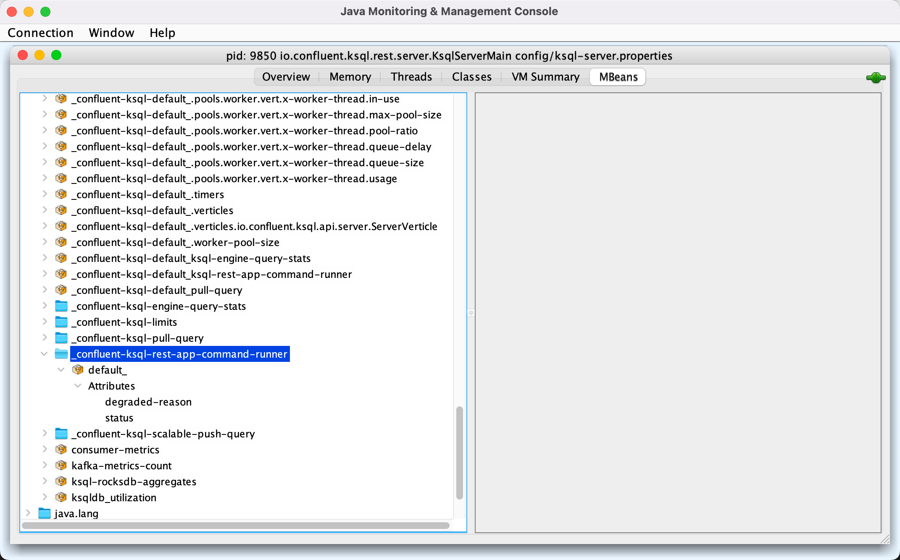

# CommandRunnerMetrics

`CommandRunnerMetrics` is the [performance metrics](#performance-metrics) of the [CommandRunner](CommandRunner.md#commandRunnerMetric).

## Performance Metrics

The performance metrics use `ksql_service_id` tag with [ksql.service.id](#ksqlServiceId).

<span id="commandRunnerStatusMetricName"><span id="commandRunnerDegradedReasonMetricName">

Name | Group | Description
-----|-------|------------
 `degraded-reason` | `_confluent-[metricGroupName]` | The [reason](CommandRunner.md#getCommandRunnerDegradedReason) for why the [CommandRunner](CommandRunner.md) thread is in a DEGRADED state
 `status` | `_confluent-[metricGroupName]` | The [status](CommandRunner.md#checkCommandRunnerStatus) of the [CommandRunner](CommandRunner.md) thread

<figure markdown>
  
</figure>

## Creating Instance

`CommandRunnerMetrics` takes the following to be created:

* <span id="metrics"> `Metrics`
* <span id="commandRunner"> [CommandRunner](CommandRunner.md)
* <span id="ksqlServiceId"> [ksql.service.id](../KsqlConfig.md#KSQL_SERVICE_ID_CONFIG)
* <span id="metricsGroupPrefix"> Metrics group prefix (default: [ksql-rest-app](#DEFAULT_METRIC_GROUP_PREFIX))

`CommandRunnerMetrics` is created along with [CommandRunner](CommandRunner.md#commandRunnerMetric).

## <span id="metricGroupName"> Metrics Group Name

`CommandRunnerMetrics` uses the [metricsGroupPrefix](#metricsGroupPrefix) (default: [ksql-rest-app](#DEFAULT_METRIC_GROUP_PREFIX)) for the metrics group name of the [metrics](#performance-metrics).

```text
[metricsGroupPrefix]-command-runner
```

## <span id="DEFAULT_METRIC_GROUP_PREFIX"> Default Metrics Group Prefix

`CommandRunnerMetrics` uses `ksql-rest-app` prefix as the [metricsGroupPrefix](#metricsGroupPrefix) by default (unless overriden).
