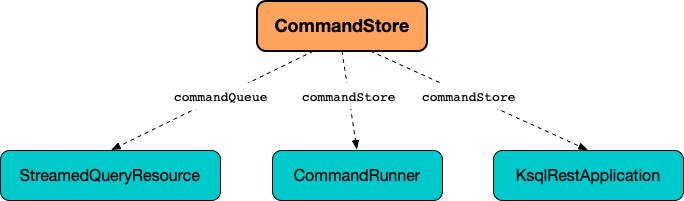

# CommandStore

`CommandStore` is a [CommandQueue](CommandQueue.md) that uses the [CommandTopic](#commandTopic) for [fetching commands](#getNewCommands).

`CommandStore` is used to create the following services while [building a KsqlRestApplication](KsqlRestApplication.md#buildApplication):

* [StreamedQueryResource](StreamedQueryResource.md#commandQueue)
* [CommandRunner](CommandRunner.md#commandStore)
* [KsqlRestApplication](KsqlRestApplication.md#commandStore)

<figure markdown>
  
</figure>

## Creating Instance

`CommandStore` takes the following to be created:

* [Name of the Command Topic](#commandTopicName)
* [CommandTopic](#commandTopic)
* [SequenceNumberFutureStore](#sequenceNumberFutureStore)
* [Kafka Consumer Properties](#kafkaConsumerProperties)
* [Kafka Producer properties](#kafkaProducerProperties)
* <span id="commandQueueCatchupTimeout"> [ksql.server.command.response.timeout.ms](KsqlRestConfig.md#ksql.server.command.response.timeout.ms)
* <span id="commandIdSerializer"> `Serializer<CommandId>`
* <span id="commandSerializer"> `Serializer<Command>`
* <span id="commandIdDeserializer"> `Deserializer<CommandId>`
* <span id="commandTopicBackup"> `CommandTopicBackup`

`CommandStore` is created using [Factory.create](#create) utility.

### <span id="sequenceNumberFutureStore"> SequenceNumberFutureStore

`CommandStore` is given a [SequenceNumberFutureStore](SequenceNumberFutureStore.md) when [created](#creating-instance).

The `SequenceNumberFutureStore` is used when:

* [ensureConsumedPast](#ensureConsumedPast) (to pause until earlier commands are completed)
* [completeSatisfiedSequenceNumberFutures](#completeSatisfiedSequenceNumberFutures) (to mark commands completed)

### <span id="kafkaConsumerProperties"> Kafka Consumer Properties

```java
Map<String, Object> kafkaConsumerProperties
```

`CommandStore` is given `kafkaConsumerProperties` when [created](#creating-instance).

The properties are used to create a `KafkaConsumer` ([Apache Kafka]({{ book.kafka }}/clients/consumer/KafkaConsumer/)) for the [end offset in the command topic](#getCommandTopicOffset).

### <span id="kafkaProducerProperties"> Kafka Producer properties

```java
Map<String, Object> kafkaProducerProperties
```

`CommandStore` is given `kafkaProducerProperties` when [created](#creating-instance).

The properties are used to create a `KafkaProducer` ([Apache Kafka]({{ book.kafka }}/clients/producer/KafkaProducer/)) at [createTransactionalProducer](#createTransactionalProducer).

### <span id="commandTopic"> CommandTopic

`CommandStore` is given a [CommandTopic](CommandTopic.md) when [created](#creating-instance).

The `CommandTopic` is [started](CommandTopic.md#start) in [start](#start) and runs until [close](#close).

Used when:

* [getNewCommands](#getNewCommands)
* [getCommandTopicName](#getCommandTopicName)
* [getRestoreCommands](#getRestoreCommands)
* [isEmpty](#isEmpty)
* [completeSatisfiedSequenceNumberFutures](#completeSatisfiedSequenceNumberFutures)
* [wakeup](#wakeup)

### <span id="commandTopicName"> Command Topic Name

`CommandStore` is given the name of the command topic when [created](#creating-instance).

The topic name is used when:

* [enqueueCommand](#enqueueCommand) (to send commands to)
* [getNewCommands](#getNewCommands) (to fetch commands from)
* [getCommandTopicOffset](#getCommandTopicOffset) (to fetch command offsets from)

## <span id="COMMAND_TOPIC_PARTITION"> Partition 0

`CommandStore` uses just a single partition (`0`) for [enqueueCommand](#enqueueCommand) onto and [getCommandTopicOffset](#getCommandTopicOffset) from the [commandTopicName](#commandTopicName).

## <span id="create"><span id="Factory"> Creating CommandStore

```java
CommandStore create(
  KsqlConfig ksqlConfig,
  String commandTopicName,
  Duration commandQueueCatchupTimeout,
  Map<String, Object> kafkaConsumerProperties,
  Map<String, Object> kafkaProducerProperties,
  KafkaTopicClient internalTopicClient)
```

`create` adds the following configuration properties to the given `kafkaConsumerProperties` (possibly overriding the current values if set).

Configuration Property | Value
-----------------------|---------
 `isolation.level` | `READ_COMMITTED`
 `auto.offset.reset` | `none`

`create` adds the following configuration properties to the given `kafkaProducerProperties` (possibly overriding the current values if set).

Configuration Property | Value
-----------------------|---------
 `transactional.id` | [ksql.service.id](../KsqlConfig.md#KSQL_SERVICE_ID_CONFIG)
 `acks` | `all`

`create` creates a `CommandTopicBackup` (based on [ksql.metastore.backup.location](../KsqlConfig.md#KSQL_METASTORE_BACKUP_LOCATION)).

In the end, `create` creates a [CommandStore](#creating-instance) with the following:

* The given `commandTopicName`
* A new [CommandTopic](CommandTopic.md)
* A new `SequenceNumberFutureStore`
* _others_

---

`create` is used when:

* `KsqlRestApplication` utility is used to [build a KsqlRestApplication instance](KsqlRestApplication.md#buildApplication)

## <span id="start"> Starting Up

```java
void start()
```

`start` requests the [CommandTopic](#commandTopic) to [start](CommandTopic.md#start).

---

`start` is used when:

* `KsqlRestApplication` is requested to [initialize](KsqlRestApplication.md#initialize)

## <span id="enqueueCommand"> enqueueCommand

```java
QueuedCommandStatus enqueueCommand(
  CommandId commandId,
  Command command,
  Producer<CommandId, Command> transactionalProducer)
```

`enqueueCommand` is part of the [CommandQueue](CommandQueue.md#enqueueCommand) abstraction.

---

`enqueueCommand` creates a `ProducerRecord` ([Apache Kafka]({{ book.kafka }}/clients/producer/ProducerRecord)) as follows:

* Topic: [commandTopicName](#commandTopicName)
* Partition: `0`
* Key: the given `commandId`
* Value: the given [Command](Command.md)

`enqueueCommand` requests the given `transactionalProducer` to send the record.

`enqueueCommand` returns a `QueuedCommandStatus` with the record offset (and a `CommandStatusFuture`).

## <span id="getNewCommands"> Fetching New Commands

```java
List<QueuedCommand> getNewCommands(
  Duration timeout)
```

`getNewCommands` is part of the [CommandQueue](CommandQueue.md#getNewCommands) abstraction.

---

`getNewCommands` [completeSatisfiedSequenceNumberFutures](#completeSatisfiedSequenceNumberFutures).

`getNewCommands` requests the [CommandTopic](#commandTopic) for [new commands](CommandTopic.md#getNewCommands) (`ConsumerRecord<byte[], byte[]>`s).

`getNewCommands` creates a `QueuedCommand` for every new command with a non-`null` value.

`getNewCommands` returns the `QueuedCommand`s.

### <span id="completeSatisfiedSequenceNumberFutures"> completeSatisfiedSequenceNumberFutures

```java
void completeSatisfiedSequenceNumberFutures()
```

`completeSatisfiedSequenceNumberFutures` requests the [CommandTopic](#commandTopic) for the [current consumer position](CommandTopic.md#getCommandTopicConsumerPosition) that is then used to request the [SequenceNumberFutureStore](#sequenceNumberFutureStore) to [complete futures up to this position](SequenceNumberFutureStore.md#completeFuturesUpToAndIncludingSequenceNumber).

## <span id="createTransactionalProducer"> Creating Transactional Kafka Producer

```java
Producer<CommandId, Command> createTransactionalProducer()
```

`createTransactionalProducer` is part of the [CommandQueue](CommandQueue.md#createTransactionalProducer) abstraction.

---

`createTransactionalProducer` creates a `KafkaProducer` ([Apache Kafka]({{ book.kafka }}/clients/producer/KafkaProducer/)) with the following:

* [kafkaProducerProperties](#kafkaProducerProperties)
* [commandIdSerializer](#commandIdSerializer) as the key serializer
* [commandSerializer](#commandSerializer) as the value serializer

## <span id="ensureConsumedPast"> ensureConsumedPast

```java
void ensureConsumedPast(
  long seqNum,
  Duration timeout)
```

`ensureConsumedPast` is part of the [CommandQueue](CommandQueue.md#ensureConsumedPast) abstraction.

---

`ensureConsumedPast` requests the [SequenceNumberFutureStore](#sequenceNumberFutureStore) for a [CompletableFuture for the given sequence number](SequenceNumberFutureStore.md#getFutureForSequenceNumber).

In the end, `ensureConsumedPast` waits for this future to complete (if necessary) for at most given `timeout` seconds.

!!! note "Completing CompletableFuture"
    `CompletableFuture`s are completed in [completeSatisfiedSequenceNumberFutures](#completeSatisfiedSequenceNumberFutures).

## <span id="waitForCommandConsumer"> waitForCommandConsumer

```java
void waitForCommandConsumer()
```

`waitForCommandConsumer` is part of the [CommandQueue](CommandQueue.md#waitForCommandConsumer) abstraction.

---

`waitForCommandConsumer` [ensureConsumedPast](#ensureConsumedPast) (with the [end offset in the command topic](#getCommandTopicOffset) and [commandQueueCatchupTimeout](#commandQueueCatchupTimeout)).

### <span id="getCommandTopicOffset"> End Offset in Command Topic

```java
long getCommandTopicOffset()
```

`getCommandTopicOffset` creates a `TopicPartition` for the command topic (with the [name](#commandTopicName) and [partition 0](#COMMAND_TOPIC_PARTITION)).

`getCommandTopicOffset` creates a `KafkaConsumer` ([Apache Kafka]({{ book.kafka }}/clients/consumer/KafkaConsumer/)) with the [consumer properties](#kafkaConsumerProperties) (and `ByteArrayDeserializer`s for the keys and values).

`getCommandTopicOffset` requests the `KafkaConsumer` to `KafkaConsumer.assign` itself to consume records from the `TopicPartition` only and then `KafkaConsumer.endOffsets`.

## Logging

Enable `ALL` logging level for `io.confluent.ksql.rest.server.computation.CommandStore` logger to see what happens inside.

Add the following line to `log4j.properties`:

```text
log4j.logger.io.confluent.ksql.rest.server.computation.CommandStore=ALL
```

Refer to [Logging](../logging.md).
