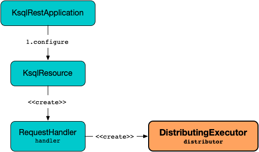

# DistributingExecutor

`DistributingExecutor` is created for [RequestHandler](RequestHandler.md#distributor) (to [execute KSQL statements](RequestHandler.md#executeStatement)).

<figure markdown>
  
</figure>

When requested to [execute a statement](#execute), `DistributingExecutor` uses a transactional Kafka producer to [enqueue the command](CommandQueue.md#enqueueCommand) (to the [CommandQueue](#commandQueue)).

## Creating Instance

`DistributingExecutor` takes the following to be created:

* <span id="ksqlConfig"> [KsqlConfig](../KsqlConfig.md)
* <span id="commandQueue"> [CommandQueue](CommandQueue.md)
* <span id="distributedCmdResponseTimeout"> [ksql.server.command.response.timeout.ms](KsqlRestConfig.md#ksql.server.command.response.timeout.ms)
* <span id="injectorFactory"> [Injector](../Injector.md) factory (for a [KsqlExecutionContext](../KsqlExecutionContext.md) and [ServiceContext](../ServiceContext.md))
* <span id="authorizationValidator"> `KsqlAuthorizationValidator`
* <span id="validatedCommandFactory"> [ValidatedCommandFactory](ValidatedCommandFactory.md)
* <span id="errorHandler"> Error Handler
* <span id="commandRunnerWarning"> CommandRunner Warning (`Supplier<String>`)

`DistributingExecutor` is created when:

* `KsqlResource` is requested to [configure](KsqlResource.md#configure) (and creates a [RequestHandler](KsqlResource.md#handler))

### <span id="commandIdAssigner"> CommandIdAssigner

`DistributingExecutor` creates a [CommandIdAssigner](CommandIdAssigner.md) when [created](#creating-instance).

The `CommandIdAssigner` is used to [generate a CommandId](CommandIdAssigner.md#getCommandId) to [execute a KSQL statement](#execute).

## <span id="execute"> Executing Statement

```java
StatementExecutorResponse execute(
  ConfiguredStatement<? extends Statement> statement,
  KsqlExecutionContext executionContext,
  KsqlSecurityContext securityContext)
```

`execute` requests the [injectorFactory](#injectorFactory) to [inject](../Injector.md#inject) into the given `ConfiguredStatement`.

For a [InsertInto](../parser/InsertInto.md) statement, `execute` [validateInsertIntoQueries](#validateInsertIntoQueries).

`execute` [checkIfNotExistsResponse](#checkIfNotExistsResponse).

`execute` [checkAuthorization](#checkAuthorization).

`execute` requests the [CommandQueue](#commandQueue) for a [transactional Kafka producer](CommandQueue.md#createTransactionalProducer) (`Producer<CommandId, Command>` to produce to the [command topic](CommandTopic.md)).

`execute` initialize transactions (using Kafka's [Producer.initTransactions]({{ book.kafka }}/clients/producer/Producer#initTransactions)).

`execute` starts a transaction (using Kafka's [Producer.beginTransaction]({{ book.kafka }}/clients/producer/Producer#beginTransaction)).

`execute` requests the [CommandQueue](#commandQueue) to [waitForCommandConsumer](CommandQueue.md#waitForCommandConsumer) (to let it process all available commands).

`execute`...FIXME

`execute` requests the [CommandQueue](#commandQueue) to [enqueue the command](CommandQueue.md#enqueueCommand) and commits the transaction (using Kafka's [Producer.commitTransaction]({{ book.kafka }}/clients/producer/Producer#commitTransaction)).

`execute` waits for the final status (of executing the command) [distributedCmdResponseTimeout](#distributedCmdResponseTimeout) time.

In the end, `execute` creates a `StatementExecutorResponse` (as handled) and closes the transactional Kafka producer.

---

`execute` is used when:

* `RequestHandler` is requested to [execute a SQL statement](RequestHandler.md#executeStatement)

### <span id="validateInsertIntoQueries"> validateInsertIntoQueries

```java
void validateInsertIntoQueries(
  MetaStore metaStore,
  InsertInto insertInto)
```

`validateInsertIntoQueries` throws a `KsqlException` when the given [MetaStore](../MetaStore.md) could not [find a DataSource](../MetaStore.md#getSource) for the [target](../parser/InsertInto.md#getTarget) of the given [InsertInto](../parser/InsertInto.md).

```text
Cannot insert into an unknown stream: [target]
```

`validateInsertIntoQueries` throws a `KsqlException` when the [underlying topic](../DataSource.md#getKafkaTopicName) (of the `DataSource`) is [read-only](ReservedInternalTopics.md#isReadOnly):

```text
Cannot insert into read-only topic: [topic]
```

`validateInsertIntoQueries` throws a `KsqlException` when the `DataSource` has header columns:

```text
Cannot insert into [target] because it has header columns
```
